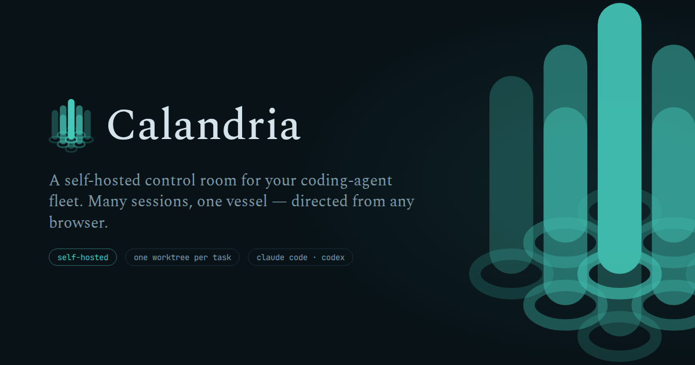
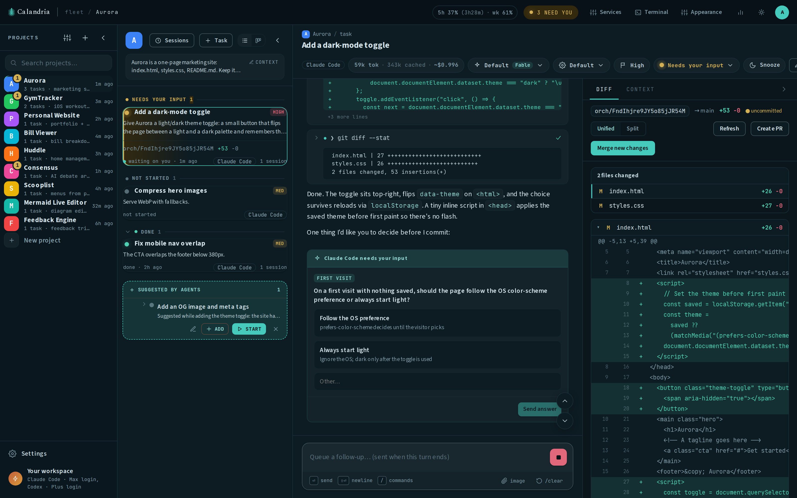

<div align="center">



### Run Claude Code and Codex in parallel across every project, from any browser.

Calandria is a web-based control room for your coding agents. Run it locally
or self-host it on a server; a deployed workspace is reachable from your
computer, tablet, or phone. Every task gets a persistent agent session in an
isolated git worktree, and your existing Max, Pro, or ChatGPT subscription
covers it.

[**Run locally**](#run-locally) · [**Self-host**](docs/SELF_HOSTING.md) · [**Request a feature**](https://github.com/calandria-dev/calandria/discussions/categories/ideas)

[](LICENSE)
[](package.json)
[](CONTRIBUTING.md)



</div>

## Why Calandria

- **Your workspace is wherever you are.** Deploy once, manage agents from any
  device with a browser.
- **Run many tasks without juggling terminals.** Every task has its own
  worktree, branch, transcript, and agent session.
- **Know where you are needed.** A cross-project inbox surfaces sessions
  waiting for input while the rest keep working.
- **Stay in control of every change.** Review the diff beside the
  conversation, then merge, resolve conflicts, or open a pull request.
- **Branch from the latest base.** Calandria fetches the base branch before
  cutting a task's worktree, so a PR merged on GitHub doesn't leave new tasks
  building on stale code, and it tells you when your own checkout has fallen
  behind.

## How it works

**Create tasks → connect them into a pipeline → Calandria gives each one an
isolated worktree and runs it when its dependencies finish → it alerts you
when needed → you review and merge.**

Project context is written once and carried into each task. Server-owned
turns and persisted transcripts survive browser reloads and laptop sleep,
and `/clear` starts a fresh context window while preserving the task's
lineage. When a Claude turn starts background shell work or schedules a
wakeup (`ScheduleWakeup`, `CronCreate`, `/loop`), the session lingers after
the model stops — the task shows "working in background" or "waiting to
wake at 12:00" with its age, the work runs to completion or the wakeup
fires, and that wakes the agent to continue. No deadline by default: a
session held too long (a recurring `/loop` holds it open until stopped) is
yours to stop, not the harness's to kill (`ORCH_BACKGROUND_LINGER_MS` sets
an optional auto-cut — a wakeup beyond it is cancelled and named in the
transcript; `ORCH_BACKGROUND_LINGER=off` disables lingering, and then every
pending wakeup is reported cancelled at the end of the turn instead of
silently dying with the process).

## What makes it different

- **Parallel, isolated tasks:** work across multiple repositories without
  agents mixing files or branches.
- **Web-based and self-hostable:** run Calandria on your own machine or
  server, then securely access the same workspace from desktop or mobile.
- **One "Needs you" inbox:** jump directly to any session waiting for an
  answer.
- **Snooze a task:** park anything until an hour from now, tomorrow morning,
  or an exact date. It stops counting toward the inbox, then returns to the
  category it left, marked as having been snoozed.
- **Persistent context:** reuse project knowledge and continue long-running
  work across fresh context windows.
- **Review-to-merge workflow:** inspect diffs, sync branches, resolve
  conflicts, merge, or create a GitHub PR from the same screen.
- **Collaborate on documents:** open a file the agent wrote as a document
  (mermaid fences rendered as diagrams) — edit the text, select passages and
  attach comments — and send the lot back
  as one message: your comments in place (saved as you go), your edits either
  written straight into the task's worktree (default) or sent as a diff for
  the agent to apply. Reachable from the diff or straight from the Write/Edit
  card in the transcript, so a gitignored notes file is a click away the
  moment it's written.
- **Branching task pipelines:** make tasks depend on one or several earlier
  tasks, branch work into parallel paths, and launch each task automatically
  when its blockers finish.
- **Runbooks:** save a task you run often ("push everything unpushed and
  babysit CI", "sweep my Jiras and report") as a named recipe, then dispatch
  it in one click. Each run mints a fresh task, and a box for this-run-only
  instructions covers the bits that change.
- **Scheduled tasks:** run a saved prompt on a recurring day and time in its
  own timezone, with nobody logged in. Each firing mints a fresh task you
  review like any other, and can fire a runbook so one recipe serves both
  the clock and the button.
- **Notifications:** when a task stops and waits for you, when a turn fails,
  or when a scheduled run fails — as a browser notification in any open tab,
  and as a push to your phone with the app closed. Quiet only when you're
  already looking at the task in question.
- **Installable app:** a PWA with its own icon and standalone window — install
  from Chrome/Edge or iOS Add to Home Screen and the "needs you" inbox lives
  on your phone's home screen (needs HTTPS, works behind Cloudflare Access).
- **A complete workspace:** chat, terminal, managed services, live logs, and
  transparent token and usage insights stay together — including a live
  session/week plan-usage meter for a Claude Pro/Max login.


[Explore all features](docs/FEATURES.md)

## Supported agents

Calandria supports **Claude Code** and **OpenAI Codex** end to end. Choose an
agent per task, or connect only the one you use. Both work with subscription
login; API keys remain an optional explicit choice.

[Agent support, permissions, and usage details](docs/AGENTS.md)

## Run locally

You need Node 20.9+, macOS or Linux, and at least one supported agent CLI.

```bash
npm install
npm run build
npm start
```

Open <http://localhost:3000>. The first-run wizard connects Claude Code or
Codex and takes you through a short hands-on tutorial.

Prefer a container? A multi-arch image (`linux/amd64` + `linux/arm64`) is published
publicly: `latest` is the newest tagged release, `edge` tracks nightly builds of `main`.

```bash
docker pull ghcr.io/calandria-dev/calandria:edge
```

Use `npm run dev` only when developing Calandria itself. For Docker tags and
provenance, authentication, networking, and secure access from anywhere, see
the [self-hosting guide](docs/SELF_HOSTING.md). Layering site-specific CLIs
and config on top of the published image? Start from
[`examples/overlay/`](examples/overlay/).

One instance per database: Calandria locks `orchestrator.db` at boot and
refuses to start if another process already owns it, naming the holder. Two
servers sharing one database overwrite each other's running tasks; give a
second instance its own `ORCH_DB_DIR`.

## Privacy

Calandria contains no telemetry and no analytics. It makes no outbound
requests you didn't configure: network traffic is what your agents, your git
remotes, and your own integrations generate.

## Community

- [Request a feature or share an idea](https://github.com/calandria-dev/calandria/discussions/categories/ideas)
- [Ask a question](https://github.com/calandria-dev/calandria/discussions/categories/q-a)
- [Report a bug](https://github.com/calandria-dev/calandria/issues/new?template=bug_report.yml)
- [Contribute](CONTRIBUTING.md)

See [COMMUNITY.md](docs/COMMUNITY.md) for where each kind of conversation
belongs.

## Documentation

- [Installation and local development](docs/INSTALLATION.md)
- [Features](docs/FEATURES.md)
- [Agents](docs/AGENTS.md)
- [Insights and usage](docs/INSIGHTS.md)
- [Managed services](docs/SERVICES.md)
- [Self-hosting](docs/SELF_HOSTING.md)
- [Troubleshooting](docs/TROUBLESHOOTING.md)
- [Windows compatibility assessment](docs/WINDOWS.md)
- [Architecture](docs/ARCHITECTURE.md)
- [Security](SECURITY.md)

## License

[Apache-2.0](LICENSE)

## Name and lineage

In a CANDU reactor, the calandria is the vessel through which hundreds of
parallel fuel channels run: one vessel, many channels, each doing its work
in isolation, all of it one coordinated machine. That is what this software
does.

Calandria began as a fork of
[Operator](https://github.com/iishyfishyy/operator-oss) by
[@iishyfishyy](https://github.com/iishyfishyy). It keeps Operator's
Apache-2.0 license; see [LICENSE](LICENSE) and [NOTICE](NOTICE). Calandria
is not affiliated with the upstream project or its hosted service; bugs and
ideas for Calandria belong in
[this repo's issues](https://github.com/calandria-dev/calandria/issues).
