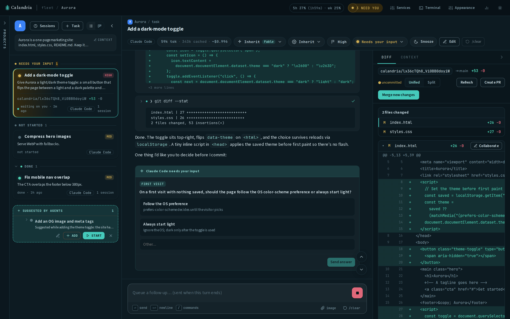
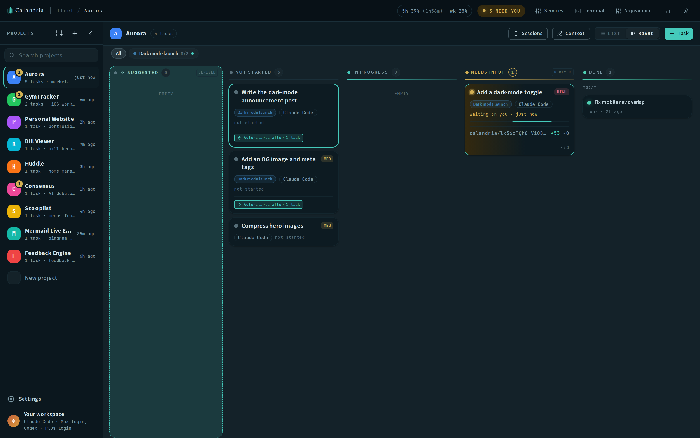
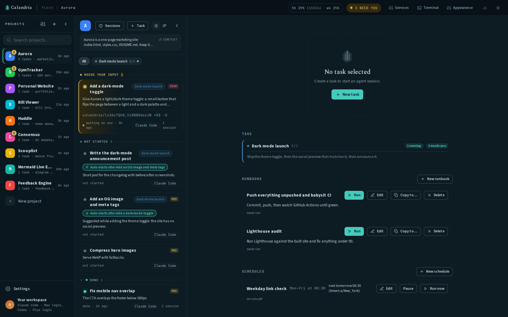
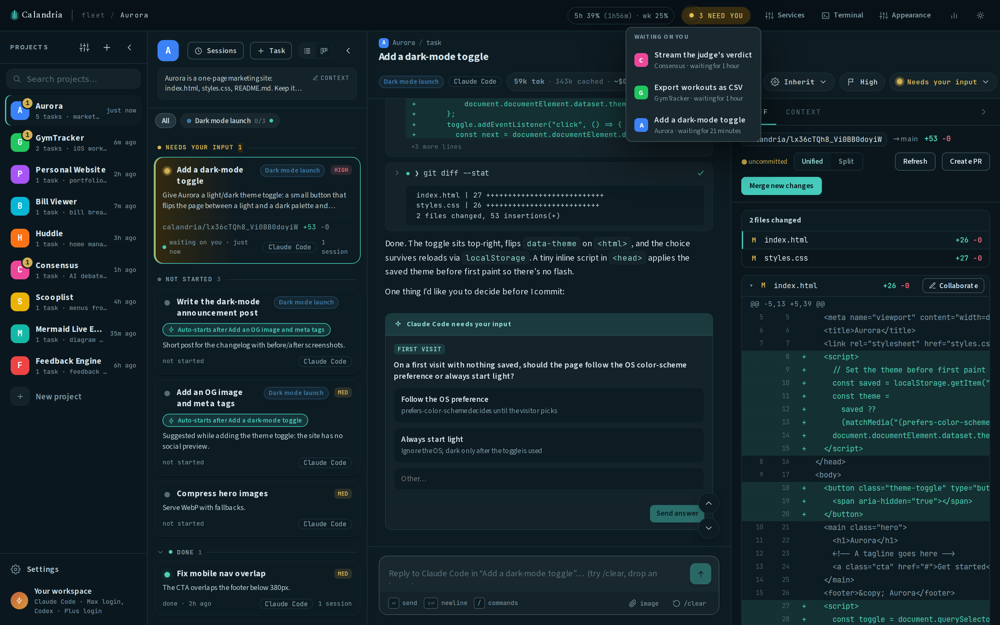
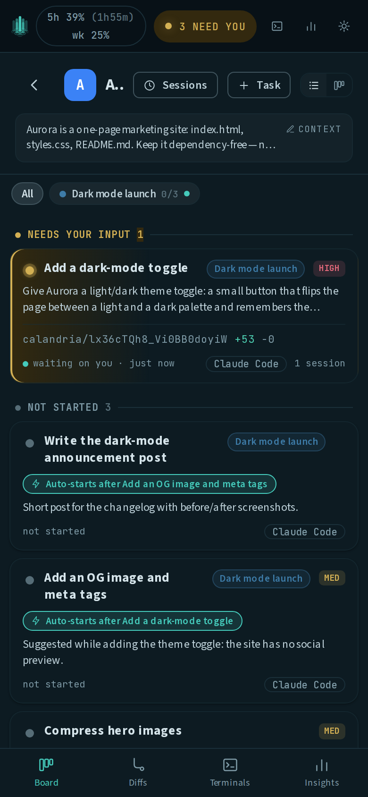
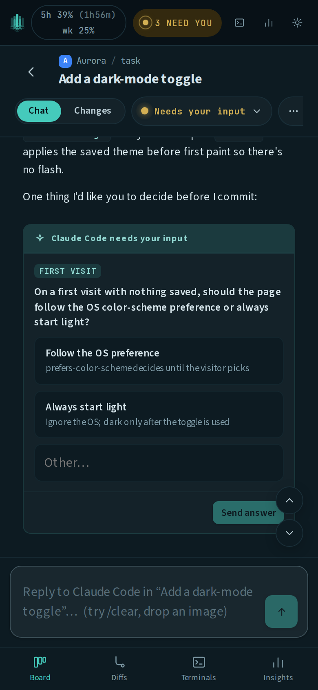

# Features

Calandria is a control room for running coding-agent work across repositories. This page
contains the longer feature inventory kept out of the project README.

## Parallel work without collisions

Each task runs in its own git worktree and branch, with an independent Claude Code or Codex
session. Projects and tasks share one workspace, so you can run many sessions without mixing
their files, terminals, or transcripts.

The cross-project **Needs you** signal identifies sessions waiting for input. Turns run on
the server and their events are persisted, so reloading the page or sleeping your laptop
doesn't lose the transcript. You can queue follow-ups while a turn is running.

## Context that survives the task

Each project has reusable context that gets injected into new tasks. **Refresh with AI**
redrafts that context from the repository. You can turn off context injection for an
individual project or task if you want a leaner session.

A task is a lineage of agent sessions. `/clear` summarizes the current conversation and
starts a clean context window seeded with that summary, so long-running work doesn't turn
into one unbounded prompt.

Typing `/` in the composer opens the command menu. It lists the commands the task's own
agent actually expands: your skills, plugin commands, and the `.claude/commands` in the
checked-out repo, discovered live from the agent, so a command you install shows up without
a Calandria release. An MCP server's prompts (`/mcp__server__prompt`) show up too, once the
task has run at least one turn (reading them without spawning your whole MCP fleet isn't
possible before that, so Calandria collects them from the task's own sessions instead).
Arrow keys move the highlight, Enter or Tab completes it, and a command typed in full sends
as usual. Calandria's own `/clear` heads the list; the agent's same-named command is hidden
so the name only means one thing, and so are the run-control commands (`/model`, `/effort`,
`/fast`), which have their own pickers.

## Review and delivery

Calandria puts the task conversation and git diff side by side. From there you can:

- review every changed file before it reaches the base branch;
- sync a stale task branch;
- merge with one click;
- ask the agent to resolve conflicts; or
- create a GitHub pull request.



Once a task has a PR, its session header carries a live chip: the PR number, whether it is
open, merged or closed, how its checks are doing, and the review decision. Calandria keeps
that current by re-reading the PR from GitHub (`gh pr view`) in the background — when the PR
is created, when you open the task, when you press the chip's Refresh button, and on a timer
while the PR is still open. Nothing polls from the browser: a change reaches every open tab
over the same event stream every other lifecycle fact uses. A merged or closed PR is never
re-read, and a sweep is skipped entirely when no tab is open, so the cost is bounded by open
work rather than by how many PRs the instance has ever opened. `CALANDRIA_PR_POLL_MS=0`
turns the timer off and leaves the other three triggers.

Worktrees for merged or finished tasks can be reclaimed from Settings. Discarding unmerged
work requires an explicit permanent-discard confirmation.

### Collaborating on a document

A text file the agent wrote or changed carries a **Collaborate** button in two places: its
diff header in the Changes tab, and the **Write**/**Edit** tool card in the transcript. The
button appears the moment the file is written, even under a gitignored directory that never
shows up in the diff, because it's keyed on the path the agent wrote rather than on git
status.

It opens the file as a document with two tabs: **Edit** (a source editor, with a live render
beside it for markdown, and ```mermaid fences drawn as diagrams) and **Comment** (select a
passage and attach a note, plus a general comments box). **Send to agent** turns your edits
into a unified diff (or writes them straight into the worktree, the default) and your
comments into located, quoted feedback, sent as one message through the ordinary chat path.
Passage comments save as you add them and survive a reload. Sent comments stay listed
against the document, read-only, and collapse into an outdated group once the document
changes. See [DOCUMENT_COLLABORATION.md](DOCUMENT_COLLABORATION.md) for details.

### Base branches

A project has a default base branch, and a task can name its own instead. That one setting
controls what the task's worktree is cut from, what **Sync** catches it up to, what
**Merge** lands it into, and what a PR is opened against. It lets five agents work against
`feature/auth` while three others keep shipping to `main`, without a second project row
pointed at the same repo (which would split the task list, recap and insights in half).

Set it in the task's edit dialog under **Base branch**. Leave it empty to follow the
project; the inherited value shows as the placeholder so you can see it without filling the
field in. Any local branch works, and so does one that exists only on the remote: a
colleague's freshly pushed `feature/auth` is created locally, tracking it, instead of being
refused as unknown. A branch checked out in another worktree is refused (including another
task's own `calandria/…` branch), because merging moves that branch's ref, which would leave
the other session pointed at a commit it no longer describes. The refusal names the worktree
holding it.

Retargeting never rewrites history. A task that hasn't committed yet is re-cut from the new
base, so it's fully up to date rather than just pointed at it. A task that has committed
keeps every commit and shows how far behind the new base it now is; one Sync catches it up.
Once a task's worktree is cut, the branch it forked from is recorded on the task, so
retargeting later can't move its merge target out from under work already built on it. Tasks
on a base of their own are badged in the task list and the Changes tab; tasks following the
project default aren't badged.

**A tag can set the base for a whole plan**, so a five-task feature is configured once
instead of five times. Expand its chip and fill in **Base branch** in the strip's Edit form.
Every task tagged with it from then on is cut from that branch. The field shows how many
members are already past their worktree cut (and so keep their existing branch) and how many
take their base from a different tag. A task can carry several tags; if more than one sets a
base branch, the **first tag on the task** (in the order its badges render) wins, and the
strip names it. Resolution order: the task's own base, then the first of its tags that sets
one, then the project's default. Moving a task to another project clears both, since a
branch name doesn't carry over to a different repository.

### How work lands: merge or pull request

A project also records **how** its work is meant to reach that branch, in the project
settings dialog under **How work lands**:

- **Merge** — Calandria merges the finished task branch into the base branch itself. This is
  the default, and what every project did before this setting existed.
- **Pull request** — the base branch is protected, so a merge is rejected by GitHub.
  Finishing a task means opening a PR against it and leaving it for review.

The setting is not cosmetic: it is the sentence every session in the project is told. Under
`merge` the agent reads "Merge lands into it"; under `pr` it is told the branch is protected,
that Merge will be rejected, and that finishing means opening a PR. On a repo with a branch
ruleset, the old unconditional wording sent every session off to press a button that could
not work.

Under `pr` the session also gets the verb to go with the sentence: **`create_pr(title?,
body?)`** commits the worktree, pushes the work branch and runs `gh pr create` — the same
machinery the PR button runs, so a session's PR and a human's are the same operation.
Calling it again after more work updates the same PR rather than opening a second one. It
exists because a session's own `git push` and `gh pr create` are normally refused — the
server is where the network git lives — so without it a finished task had no way to say so
in git and landing was entirely a human click. It is registered only on a `pr` project: on a
`merge` project there is nothing for it to open, so it is absent rather than
present-and-refusing. There is deliberately no `merge_pr` — opening a PR is proposing,
merging is deciding, and that stays yours.

**Detect** asks GitHub which it is, reading both mechanisms — a branch ruleset with a
`pull_request` rule, and classic branch protection, neither of which reports the other. It
runs on its own when you open the settings dialog and when you point a new project at a
folder or clone one. Detection only ever *proposes*: at project creation it preselects the
answer, and on an existing project it shows what GitHub said beside a one-click **Use pull
request** rather than overwriting a choice you made. A repo that requires PRs while you
deliberately merge into a staging branch locally is a real configuration, and only you know
about it. When GitHub can't be reached, or the repo is private to a login `gh` doesn't have,
the probe says so instead of guessing "merge".

Agents can retarget tasks too. `set_base_branch(branch, task?)` defaults to the session's own
task mid-turn, or can name any other task in the same project, running the same retarget as
the edit dialog, refusals included. It's a separate tool from `update_task` because it moves
a real worktree and can fail partway through. Retargeting another task shows as an agent
change on the board with a one-click revert. `update_tag(tag, {name?, description?, color?,
base_branch?})` edits the tag itself, separately from `update_task`'s `tags` field, which only
sets which tags a task carries. There is no delete verb for a tag; deleting is a manual,
hard-delete action with no undo.

### Staying level with the remote

Work also arrives outside the merge button: a pull request merged on GitHub, a teammate's
push, a pull in another checkout. Calandria fetches the base branch (best-effort) when you
open a project and again before it cuts a new task worktree, so a new task starts from the
real remote tip instead of a local `main` that's gone stale.

Your own checkout is never moved without your say-so. When local `main` is behind, the
project header offers a one-click fast-forward. When it's ahead, it offers a push. When the
two have diverged, it says so and leaves the resolution to you. After a merge lands, the same
push is offered inline. Set `CALANDRIA_GIT_FETCH=off` to keep an instance entirely offline.

When the base branch advances, an in-flight task's pending merge can go from a plain
fast-forward to needing a sync first; the sync banner explains that the base moved. When the
sync conflicts, **Fix with AI** runs a resolution turn that edits the files marker-free but
doesn't commit, so the merge stays paused until you review the result. Once that turn ends,
the banner switches to "conflicts resolved" with **Accept & merge** (the same as the Changes
tab's Merge button) and **Review** to open that tab first, where **Discard** returns the
worktree to where it was. Only Accept or Discard clears the banner. If the agent leaves some
files still conflicted, the banner counts them and offers another pass.

A merge into the branch your own checkout has open runs inside that checkout, and git only
allows that on a clean tree. If it isn't clean, the merge is refused and the card shows
`git status` for that checkout, so you can tell your own uncommitted work from something a
tool dropped there (a hook-written `.gitattributes`, an editor scratch file). Clear it in a
terminal and merge again, or press **Stash N files & merge**: exactly the listed files are
stashed, the merge runs, and the stash is reapplied on top. Only files present when the card
was drawn are stashed; anything that shows up afterward is left alone. If reapplying the
stash conflicts, the stash is kept and the card prints the `git stash apply` command to
recover it. Merges into any other branch never touch your checkout.

## Planning and orchestration

Use a compact list or a full-width kanban board with Suggested, Not started, In progress,
Needs input, Ran clean, Snoozed, and Done states. Tasks can depend on other tasks;
**Start when unblocked** launches an opted-in task as soon as its final blocker is marked
done. Opt in from the edit dialog's dependency picker, or straight from the blocked task's
own start screen: its "Blocked until …" notice carries a **Start when unblocked** button, and
the queued notice it becomes carries **Cancel** to hand the start back to you.

Everywhere tasks are listed (every group in the list, every board column, the Suggested
tray), the top one is the most recently active: whatever was last created, edited, or worked
on by a turn. Nothing has to be dragged to the top, and a backlog you haven't touched in a
week sinks below one you have. On the board, dragging a card between columns changes its
status; there's no manual order to pin it in.



### Tags

A **tag** is a named, project-scoped label with a description, for grouping the tasks that
make up a feature, migration, or refactor. It has no session, worktree, or status of its
own: its progress is derived from the tasks carrying it every time you read it (done when
every one of them is done or cancelled), so there's no "close tag" action and nothing goes
stale when a task is deleted or moved.

A task can carry several tags at once: "port the login route" can be step 3 of the auth
migration, part of the 0.4 release, and part of the `flaky-tests` sweep, and its session sees
all three. Pick them in **New task** or **Edit task** from the **Tags** field, above
**Blocked by**. **New tag…** mints one inline by name; names are unique within a project and
a collision is flagged. You can tag a whole selection at once from the list's action bar:
tick the rows, click **Tags…**, and add or remove tags across all of them in a single write.
It adds and removes rather than replacing, since the rows in a selection rarely share the
same tags and a replace would silently strip ones it didn't know about.

Tags never span projects. Moving tasks applies the same rule blocked-by links get: a tag
whose every member is in the move travels with them, renamed `(moved)` if a tag with that
name already exists at the destination. A tag selected only in part stays behind, and the
tasks that moved lose that badge. Both move dialogs show which of the two will happen,
alongside any dropped blocked-by links.

Once a project has a tag, a chip bar appears over the task list and the board: **All · Auth
migration 3/7 · Mobile PWA 0/4 · Done (2)**. A chip narrows every status bucket, including the
Suggested tray, to tasks carrying it. The fraction counts done over tasks still counted (a
withdrawn or cancelled step doesn't count as unfinished). A blue dot marks a tag with a task
waiting on you, and finished tags fold behind the **Done** chip. You can light several chips
at once: by default they union, and an **any/all** toggle appears once two chips are lit to
switch to the intersection ("in the auth migration and touches mobile"). The selection is
remembered per project and survives switching between list and board views. Each task shows a
tinted badge per tag (in the list, on the board card, in the suggested tray, and in the
session header), capped at three with a `+2` pill naming the rest on hover; clicking a badge
lights that tag alone. Dragging cards on the board is paused while a chip is lit, same as
during a search.

Lighting exactly one chip opens the **tag strip** beneath the bar: the description, a
progress bar reading `3 done · 2 withdrawn`, a link back to the planning session
(**Planned in …**, when an agent filed it), and its tasks in dependency order, each with a
status dot and a step number. Its two actions are **Edit** (rename, describe, recolor from
the badge palette) and **Delete tag**, which asks twice and names how many tasks stay;
deleting a tag removes the label from its tasks without deleting them or touching their other
tags. With two chips lit, the strip stays shut.

Tags are reachable outside the task list too. The project landing page has a **Tags** card
between the recap and Runbooks, showing active tags with their progress and what needs you (a
tag with nothing filed reads *no tasks yet*); clicking one opens the list narrowed to it. ⌘K
finds a tag by name anywhere (`Auth migration · Mobile PWA 4/7`) and lands on the same
selection. **Insights** has a *Tags* leaderboard beside the projects one, summing spend and
tokens over every task carrying each tag; a task with three tags counts toward all three, so
this column doesn't sum to the project's total.

Agents can plan directly into tags. `suggest_task` takes a `tags` parameter (ids or names)
resolved in the project the task is filed into; a name that doesn't exist yet is created
there and attributed to the filing session, so one planning turn can land a whole named plan
instead of loose rows. `update_task`'s `tags` field is stricter: only existing ids or exact
names, and it replaces the set (`[]` clears it); an unknown tag refuses the whole call.
`list_tasks` takes a `tag` filter, and `list_tags` answers "how is the migration going" in
one call: description, counts, and each task's status.

A tagged session's context includes one block per tag: name and description, which step of
how many it is, sibling tasks with their statuses, and a link back to the planning session.
Sibling descriptions are left out to save context. A task with **Send project context** off
gets none of this, same as it gets no project context.

Tags and dependencies are independent: a tag means "belongs with," a blocked-by edge means
"waits for," and nothing is inferred from one to the other.

### Snoozing

The moon button on a task (in the list gutter, in the corner of a board card, or beside the
status picker in the session header) parks it until a time you pick: a one-click preset (an
hour, this evening, tomorrow, next week), a relative duration ("in 3 days"), or an exact date
and time. While parked, the task moves to **Snoozed**, shows when it comes back, and has a
sun button to wake it immediately. It also drops out of the "needs you" pill, its dropdown,
and the project badge.

Snoozing changes where a task is shown, not its status. When the deadline passes, or you wake
it by hand, or drag its card out of the column, it returns to exactly the group it came from,
marked **Was snoozed** so the reappearance makes sense. Opening the task clears that marker.
Nothing sweeps for due snoozes on a timer: one that comes due while the app is closed is just
already awake next time you look. A running turn is unaffected: a snoozed task still works,
it just stops notifying you.

### Starting at the usage-window reset

A spent subscription limit (Claude's five-hour window, the weekly cap) stops every turn on
the instance until it resets, usually at an inconvenient hour. The titlebar plan meter shows
when that is; **Start at reset** hands the wait to the server. On a task that hasn't started,
the button sits beside **Start session** and queues the first turn for a minute after the
reset the meter reports. On a task whose turn died on the limit, the notice in the transcript
offers **Resume when the limit resets**: at the reset, the session picks up the oldest queued
follow-up if you left one, otherwise a "continue where you left off" prompt. Until then, the
task's card says *Starts at 4:49 PM* (or *Resumes …*), the session header carries a chip that
cancels it, and the transcript records that the session moved on its own. Starting or
messaging the task by hand in the meantime consumes the queued start. A queued task that's
still blocked by another, or whose turn is already live, when its time comes is skipped with
a note instead of started. The button only appears for an agent whose plan reports a reset
time (a Codex task, or an API-key login, has no reset to aim at). The sweep runs on the
server, so a start queued from a phone at midnight fires with no tab open.

A misfiled task can be moved to another project from **Edit task**, keeping its description
and transcript. The move drops any blocked-by links, since dependencies can't span projects.

A task that has already run can move too, but its git worktree can't come along, since that
checkout was cut from the current project's repository. Moving it discards the worktree and
its branch: the modal tells you what's in there first. A clean, merged worktree loses
nothing; uncommitted edits or commits your base branch never took are named and need a second
confirmation. Everything else (transcript, summaries, cost history, sessions and merges)
follows the task to the new project, and the next turn cuts a fresh worktree there. A task
with a live turn is refused; stop it first.

You can move a whole batch at once: tick checkboxes in the task list (shift-click for a
range, including the Suggested tray) and use **Move to project…** in the selection bar. They
move in one transaction, and a blocked-by link whose both ends are in the selection survives
the move. Anything that can't move is named in a report. Started tasks can come along, but
each row with a worktree gets its own checkbox (off by default) showing what that checkout
holds: clean and merged, or the uncommitted edits and unmerged commits it would destroy, in
red. Leaving all of them unticked is a plain move. Three worktrees with unsaved work in a
selection of eleven don't block the other eight; those three are reported and left in place.

Agents can suggest follow-up tasks into their own project or any other one. When a session
spots work that belongs to a different repo, it looks up the project and files the suggestion
into that project's tray with that project's default agent and settings. It has to name the
project exactly (by name or id); an unrecognized name is refused. Blocked-by links still
can't span projects, so they point at tasks in whichever project the new task lands in.
Project recaps help you pick up context when you return later.

A suggestion also shows up **in the session that made it**, as a card on the tool call that
filed it: the title, priority, any blockers, the project it landed in, and the same three
actions the tray has — **Start** (cuts the worktree and launches the session right now),
**Add** (accepts it onto the task list to start later) and **Dismiss** (deletes it). Nothing
about the card is frozen into the transcript: it re-reads the task every time it renders, so
reopening the session later shows what actually became of the suggestion — *Session started*,
*Added to the task list*, withdrawn with its reason, or gone — rather than a stale button.
Start is offered only for a suggestion filed into the project you're reading: starting one
filed elsewhere would drop you out of this session and into another project, so those cards
name where the task went and leave Start to that project's tray.

Agents can also read the board: list the tasks in a project, see what each one is blocked
by, and open any task in full, including its original brief. Agents can correct any task on
the board in any project, including one you've already accepted or started: retitling it,
rewriting its brief, reprioritizing it, adding or removing tags, closing it, or changing what
it's blocked by. The one thing that stops them is a task with a turn running right now (that
session may be reading the very fields being changed); cancelling is always your call. A
correction like this shows a **"Changed by agent"** chip on the task's card, and opening it
shows what changed field by field, old value next to new, with who made the edit and when. A
**Revert** button undoes each change, and **Keep changes** clears the chip once you've looked
it over. Correcting your own row, or a suggestion still sitting unreviewed in the tray, works
the same as before but doesn't raise the chip.

An agent breaking work into ordered steps files the tasks first, then goes back and sets what
each one is blocked by, the same links you'd set in the edit dialog. On a task you've already
accepted, this raises the same "Changed by agent" chip as any other correction. An agent
can't chain a task to one in another project, and can't mark its own task as blocked by
anything, since blockers decide whether a task may start and its own task already has.

An agent that decides one of its own suggestions was redundant can **withdraw** it, giving a
reason. The card stays in your tray, struck through with the reason underneath, sorted below
the live suggestions: a recommendation to drop it, not a deletion. **Restore** puts it back
(clearing the strike-through and note), **Start** runs it anyway, and ✕ dismisses it for
good. Withdrawing is the only way an agent can retract work it proposed; it can't cancel or
delete anything.

The tray lets you read a suggestion's whole brief before deciding: each row has a disclosure
triangle that expands the one-line summary (clicking the brief does the same thing). A
withdrawn row expands to show what was proposed underneath why it was pulled. Expanding
doesn't persist across a project switch. The ✎ opens the full **Edit task** dialog, and the
tray's footer has **Save** (keeps the sharpened brief in the tray), **Add** (accepts it into
the task list), and **Add & start** (does both and launches the first session in one write).
An already-added task that hasn't started yet gets **Save & start** in the same place. Start
is greyed out, with a reason shown, while a blocker is unfinished or the task's agent isn't
connected.

When a task stops blocking, whether you mark it done, cancel it, or an agent withdraws it,
anything set to **Start when unblocked** behind it launches just as it would from your click.
Cancelling counts too: a cancelled task will never finish, so waiting on one would leave the
blocked task stuck forever.

## Runbooks



A **runbook** is a saved task-launch preset: a name, a one-line description, the prompt its
first turn sends, and the agent, permission mode, priority, and context setting to run it
under. Useful for recurring briefs like "push unpushed changes and babysit CI/CD" or "sweep
my Jiras, IMs, and email and report," where retyping the same prompt every time gets old. It
lives on the project landing pane, above **Schedules**; click the project's name at the top
of the task list to get there. Pressing **Run** mints a fresh task, exactly as a schedule
firing does, and launches its first turn.

Runbooks and schedules share the same dispatch path, so a recipe behaves identically whether
a person pressed the button or the ticker fired it. A runbook dispatch is attended, so its
turn can stop and ask you a permission question; a scheduled run declines automatically since
nobody is around to answer.

**Instructions for this run** is an optional box appended to the saved prompt at dispatch
time, for one-off additions like "…and focus on CEAP-1234." If the recipe is a slash command,
the extra text becomes part of that command's arguments.

Everything else is decided when you save the runbook, and copied onto the task at dispatch
time rather than read back later, so editing the recipe tomorrow doesn't rewrite what ran
today.

There's no separate run history: "last run" is a link to the most recent task the runbook
created.

Other things the card does:

- **Copy to…** duplicates a recipe into another project as an independent row, not a shared
  reference, since projects have different repos, agents, and command registries.
- The prompt is validated against the project's real slash-command registry before you save,
  with one-click suggestions (the same check the schedules editor runs; see the slash-command
  gotcha below). It never blocks saving.
- **⌘K** offers every runbook in the current project as its own row (`Run: Push & babysit
  CI`), dispatching immediately instead of opening the sheet. This is behind the `omniSearch`
  feature flag, off by default; set `CALANDRIA_FEATURE_OMNI_SEARCH=1` to enable it. The card
  works either way.

### Schedules that fire a runbook

A schedule can point at a runbook and take its prompt and config from that row at fire time,
so a recurring procedure like "the morning sweep" stays defined in one place. The schedule
editor names the linked runbook and warns that editing it changes what fires there, and the
runbook's row lists the schedules it feeds.

Deleting a linked runbook doesn't break the schedule: the recipe is copied back into the
schedule's own columns in the same transaction as the delete, so it keeps firing exactly what
it fired yesterday. A link across projects is refused, at save time and again at fire time,
since a runbook is written against one repo's commands.

### Agents can write runbooks

An agent that has worked out a procedure with you can save it: `create_runbook`,
`list_runbooks`, and `update_runbook` are available to every task session. An agent-created
recipe is tagged with which agent filed it, and sits inert like any other runbook until you
dispatch it.

Two things an agent cannot do:

- **Delete a runbook.** Delete is hard delete with no undo throughout Calandria; retiring a
  recipe is your call.
- **Edit a runbook that a schedule fires.** The refusal names the schedules involved, so the
  agent can tell you what it would have changed, or save a new recipe instead.

## Scheduled tasks

A schedule is a saved prompt plus a recurring day and time, owned by the project it lives in.
Find it on the project landing pane, under **Schedules**; click the project's name at the top
of the task list to get there from anywhere. A schedule fires with no browser tab open: it's
driven by a ticker in the server process, not a timer in your browser.

Each firing mints a fresh task with its own transcript, worktree, and turn, rather than
reusing one across occurrences, so every run is reviewable like a task you started by hand
and a bad run doesn't contaminate the next one's context.

**Timezone** is picked explicitly (defaulting to your browser's) rather than inferred from
the server, since the server may run in a different zone than the person who set up the
schedule (a container on UTC, a user on Pacific). The time is wall-clock, so "08:30" keeps
meaning 08:30 across a Daylight Saving transition. The editor previews the next three
occurrences as you set the days, time, and timezone, so you can catch a mistake on the form
instead of the following Monday.

**Catching up**: if the app was asleep or down when a firing was due, the next tick runs the
most recent missed slot once, marked `catch_up` (useful for a morning run discovered at noon,
not one that starts at 6pm). Anything older than that window is recorded `missed`. **Overlap**
works the same way: if the previous firing's turn is still running when the next one comes
due, the new slot is recorded `skipped_overlap` instead of piling a second turn on top of the
first.

**Permission mode is a required, explicit choice**, because a scheduled run can't answer a
permission prompt. Any mode other than the agent's never-asks mode (Claude's
**bypassPermissions**, Codex's **workspace-write**) declines every prompt automatically
instead of parking, so the turn can stop early with the job half done. Only the never-asks
mode runs a schedule all the way through unattended.

When a prompt gets declined, the run is recorded **failed**, with a note that the agent
needed approval and nobody was watching. The same goes for a question: if the agent asks one
mid-run, it's declined immediately with the question preserved in the transcript.

**Where a clean run comes to rest.** A firing that finishes the job isn't waiting on an
answer, so it stays out of the "N need you" pill. But it isn't in progress anymore either,
and nobody has read it yet, so it rests in its own state, **Ran clean**, with its own group
in the task list and its own column on the board. The card shows when it ran and has one
button, **Mark done**. Replying to it moves the task back to In progress instead.

The card also watches the ticker itself. If the scheduler isn't running, or its sweeps stop
completing, a banner says so instead of showing a next-run time that will never arrive.

**The slash-command gotcha**: a prompt like `/jira-tasks` is expanded by the CLI before the
model sees it, but an unrecognized command isn't an error. The CLI answers "Unknown command:
/x" as a success, with no tool calls, so a typo'd schedule would report green every morning
having done nothing. The editor checks the prompt against the project's real command registry
before you save and shows one-click suggestions on a failure; the same check runs again when
the schedule fires, and an unknown command there records the run as **failed** and creates no
task, since a plugin can be uninstalled or renamed between the two checks. A prompt that
merely starts with a filesystem path isn't read as a command: `/etc/passwd, tell me what's in
it` is an ordinary prompt about a file. The check reads the same command list the composer's
`/` menu offers and always reads it fresh, never cached, so a command you just installed
isn't rejected for being new. It can't verify an MCP server's `/mcp__server__prompt` (that
would require spawning your whole server fleet) or any prompt it otherwise couldn't check;
both save with a note, and run.

Save is never blocked on the check: it's a typo catcher, not an authority, since it reads one
session's command list, and a conditionally registered command can read as unknown. If the
command really is missing, the run fails loudly instead of reporting a success it didn't
earn.

## Notifications



Calandria notifies you when a task stops:

| Notification | When it fires |
|-|-|
| A task is waiting for input | An agent asked a question, needs a tool approved, or finished its turn without finishing the job. |
| A turn failed | The session died: a dead login, a spent quota, a full context window, or a crash. |
| A scheduled run failed | A schedule fired and got nowhere, with nobody watching at 08:30 to see it fail. |

Finishing a turn cleanly isn't itself a notification, and neither is a new suggestion: you're
told when a task has stopped and needs you, so a turn that hands work back to you notifies
you, while a scheduled run that finished the job, a task you already closed, and a snoozed
task all stay quiet.

Two channels carry notifications, both switched on from Settings → Notifications:

- A **browser notification** needs the app open in a tab (any tab, any window) and one grant
  of the browser's notification permission. Calandria stays quiet only when the tab is
  visible and you already have that exact task selected.
- **Push** needs nothing open at all. Subscribe a device with "Enable push on this device"
  and the notification arrives through the OS: your phone hears "a task needs you" with
  Calandria closed, and tapping it opens the app at that task. Each browser subscribes
  separately, and every subscribed device is listed in Settings with a Remove button. A
  subscription the push service reports expired is pruned automatically; one that keeps
  failing shows as failing. On iPhone and iPad, push only works for an app added to the Home
  Screen ([Install as an app](#install-as-an-app)), and the subscribe button says so. A
  device with both channels enabled sees one notification, not two.

  The instance signs its pushes with a VAPID key it mints on first use and keeps beside the
  database (`<CALANDRIA_DB_DIR>/vapid.json`; subscriptions are bound to it, so back it up
  with the database). `VAPID_SUBJECT` and `VAPID_PRIVATE_KEY` in `.env.example` are the
  knobs. For iPhone/iPad push, set `VAPID_SUBJECT` (or `PUBLIC_BASE_URL`) to a real `https:`
  origin or `mailto:` address: Apple's push service rejects the default
  `mailto:admin@localhost` with `403 BadJwtToken`, which the device list shows as *failing
  (403)*. Chrome, Android, and Firefox accept the default.

A snoozed task never shows as waiting for input, and neither does one in an archived project,
but both still report a failure.

Notifications are composed on the server: the tab and the push service receive the same
message from the same source.

## On a phone

Below 760px, the three columns collapse into one pane at a time with a bottom tab bar
(**Board · Diffs · Terminals · Insights**), and the device Back button walks the panes back
out.

<p align="center">
  
  &nbsp;&nbsp;
  
</p>

The Board tab drills down through **projects → tasks → session**, plus a fourth level, the
**project home**, reached by tapping the project's name in the task list's header. That
screen holds everything project-level rather than task-level: the "where you left off"
recap, the Tags card, [Runbooks](#runbooks), and [Scheduled tasks](#scheduled-tasks). On
desktop, the same content is what the session pane shows when no task is selected; on a
phone, that space shows the task list instead, so project home gets its own level. It's a
real route (`?home=1`), so a reload or a shared link lands back on it, and Back returns to
the task list.

Two surfaces differ from desktop. The terminal is a full-screen sheet with its own font
sizing and a Paste / Ctrl-C / Enter key row, with its own tab, instead of the desktop's
bottom drawer. The ⌘K command palette is desktop-only, since there's no keyboard to summon it
with.

**Managed services** have no phone UI yet. The Services drawer is mouse-resizable and lays
its service list beside its log pane, which doesn't fit a 390px screen, so it stays
desktop-only for now.

## Install as an app

Calandria is an installable PWA. Chrome and Edge offer "Install app" from the address bar,
and on iOS, Safari's Share → **Add to Home Screen** does the same. Installed, it gets its own
icon, its own standalone window with no browser chrome, and its own entry in the app
switcher, making the phone a real surface for the "needs you" workflow instead of a tab you
have to go find.

Two requirements, both browser rules rather than Calandria's:

- **A secure context.** Install (like the Notification permission) only works over HTTPS or
  on `localhost`/`127.0.0.1`. A tunnel such as Cloudflare Access is already HTTPS; a raw LAN
  IP over plain HTTP gets neither install nor notifications.
- **A logged-in browser.** Behind Cloudflare Access, the manifest is fetched with your
  session cookie, so install from the same browser profile you log in with. The standalone
  window shares that profile's cookies, so an existing Access session carries over; when it
  expires, the window shows the Access login and continues normally.

A service worker (`public/sw.js`) handles Web Push, so a phone with no tab open still hears
"a task needs you" ([Notifications](#notifications)); it's registered only when a device
subscribes. It has no fetch handler and no offline mode, since everything on screen is live
server state (SSE event streams, the terminal's WebSocket) with nothing useful to serve from
a cache. Chrome no longer requires a service worker for install, so install works whether or
not you ever subscribe.

## Workspace tools

The integrated terminal provides a real shell for each project. It opens in the project's
working directory; a Project/Task toggle in its bar switches the shell into the selected
task's git worktree, so you can run tests or poke at a task's changes before merging.
Managed `dev`, `setup`, and `test` services keep running after an agent turn or browser tab
ends, with live logs and stable per-project ports. Optional service hostnames can expose
previews with private, shared-link, or public visibility.

See [Managed services](SERVICES.md) for setup and security details.

## Transparent usage

Every task reports tokens and usage. The Insights dashboard breaks activity down by day,
project, and agent, and keeps Calandria's background work separate from task usage.
Subscription users see an API-price equivalent for context, not a bill.

See [Insights and usage](INSIGHTS.md) for how to read the numbers.

## Agent connections

Claude Code and Codex are first-class agent drivers. Calandria detects expired connections,
preserves queued follow-ups, and provides a reconnect action. Background jobs choose a
connected agent automatically, so a Claude-only or Codex-only installation works without
special configuration.

See [Supported agents](AGENTS.md) for capabilities and upstream limitations.
