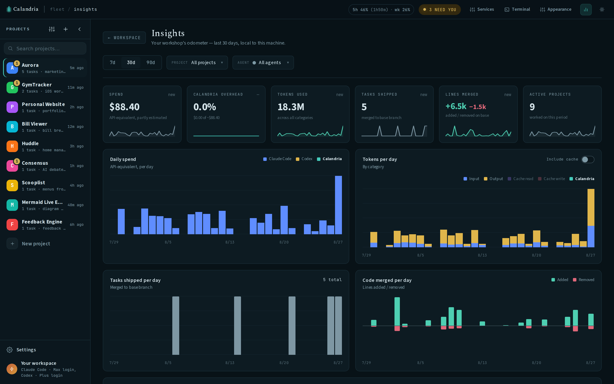

# Insights and usage

Calandria shows what your agents process and what they ship without sending repository data
elsewhere. Open **Insights** from the top bar for daily usage, tasks shipped, and lines
merged to base, filterable by project and agent across 7-, 30-, and 90-day ranges.

## Reading the task chip

A task may show a chip such as `250k tok · 3.5M cached · ~$4.20`.

| Part | Meaning |
|-|-|
| `250k tok` | Prompt, completion, and context written into the prompt cache: tokens processed for the first time |
| `3.5M cached` | Prompt-cache reads, usually the conversation so far being reused on later turns |
| `~$4.20` | Estimated API-price equivalent; the tilde marks an estimate rather than a reported charge |

Cache reads can dominate the raw count in a long task but aren't millions of tokens of new
work. Hover the chip for exact counts and the full breakdown.

Both counts describe the **main session only**. A turn that fans out to subagents runs each one
in its own context window, and Claude reports those sidechains separately from the session that
launched them — so the two figures above never included them, while the dollar figure always did.
Where a task has fanned out, the tooltip states the sidechain share on its own line
(`1,200,000 of those in subagents`) and adds it to the total, so the tokens and the dollars are
describing the same work. Agents that don't report the split omit the line rather than claim a
zero.

## Cost versus price equivalent

On a Max, Pro, or ChatGPT subscription login, turns consume plan quota. The displayed dollar
figure answers "what would these tokens cost at published API prices?" It isn't a bill, and
the marginal API charge is zero.

With an API key, the amount is billed API usage. Claude reports its SDK dollar figure
directly. Codex reports tokens only, so its amount is estimated from token counts and
published prices and carries a `~`.

## Plan usage meter

On a Claude Pro/Max or ChatGPT subscription login, the titlebar shows a compact meter with
the current session (5-hour) and week (7-day) plan utilization, plus the time left before the
session window resets. Running many parallel sessions burns a plan faster than one terminal,
so check the remaining headroom before dispatching more work. Click it for the full
breakdown: every window the provider reports (for Claude, including per-model weeks), reset
times, and data freshness. The pill tints amber at 80% and red at 95% or when a limit is
reached. Connect both agents and you get a pill each, labelled with the agent it meters.

Percentages are read conservatively in both cases: only while a tab is open, at most once per
five minutes (`CALANDRIA_PLAN_USAGE_MIN_FETCH_MS`), backing off on failure and serving the
cache in between. For Claude that read is the same usage endpoint the CLI's own `/usage`
panel uses, and it is topped up for free by the rate-limit telemetry every turn already
carries, so an approaching or reached limit shows up immediately instead of on the next poll.
Codex has no such telemetry — its turn stream reports token counts and nothing about limits —
so its figures come only from `codex app-server`'s account rate-limit view and are at most one
fetch interval old. Set `CALANDRIA_PLAN_USAGE=off` to hide the meter and stop the app from
asking either provider. The meter doesn't render for API-key auth, since there's no plan to
meter.

## Calandria overhead

Insights separates task activity from Calandria's own convenience jobs, including:

- `/clear` handoff summaries;
- project recaps;
- project-context drafts; and
- agent connection verification.

This lets you see quota spent on automation separately from the work requested in task
sessions. Settings shows the last 30 days of utility-job activity and lets you disable
unattended background work.

## Data handling

The dashboard is computed from the local SQLite database. Filtering happens in the browser;
task transcripts and repository contents are not uploaded for Insights.
